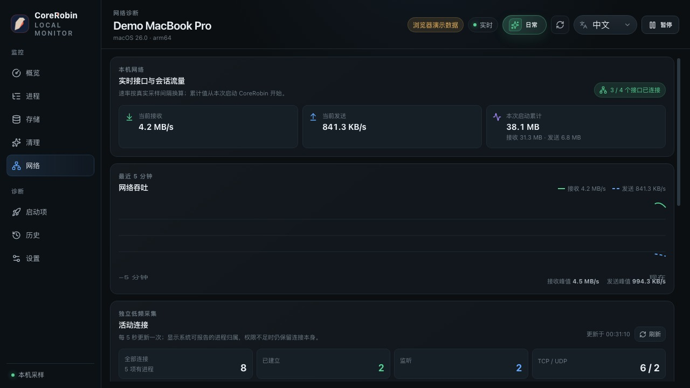
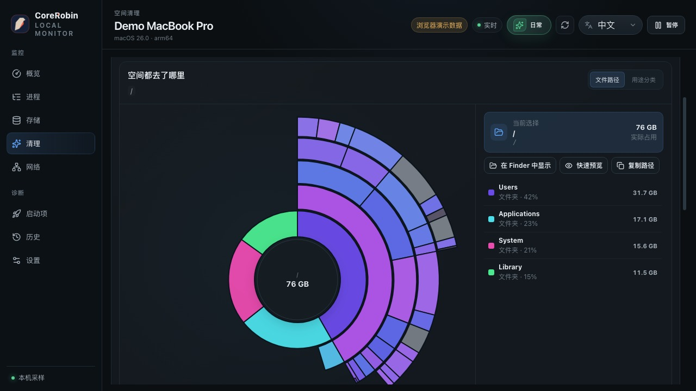

  

  <h1>CoreRobin</h1>

  
<strong>看懂电脑状态，找到问题，安全处理。</strong>

  
一个从真实感受出发的桌面状态伙伴，让电脑变慢、风扇变响、空间不足和网络异常不再只是一堆难懂的指标。

  

    
    
    
  

  

    <a href="https://github.com/JimmyDaddy/corerobin-monitor/releases/latest"><strong>下载最新版本</strong></a>
    ·
    <a href="https://monitor-app.corerobin.com/">产品网站</a>
    ·
    <a href="docs/user-guide.zh-CN.md">使用指南</a>
    ·
    <a href="https://github.com/JimmyDaddy/corerobin-monitor/issues/new/choose">问题反馈</a>
  

  

专业模式 · 在同一屏查看系统状态、资源趋势与进程详情

> 截图使用内置演示数据，不包含真实设备名称、用户名、文件路径或网络信息。

## 专业模式，把状态、趋势和进程放在同一屏

专业模式面向希望直接理解系统行为的用户：先给出稳定的健康判断，同时保留定位问题需要的实时指标、时间趋势与对象详情。你可以从概览继续进入进程、存储、网络、启动项和历史事件，而不必在多套工具之间切换。

- CPU、内存、交换空间、磁盘与网络实时状态
- 最近 5 分钟的资源趋势与影响最大的应用
- 进程树、应用详情、活动连接和启动项
- 磁盘空间、历史事件、桌面提醒与恢复通知
- 主窗口、状态栏面板和 Robin 小窗口共享的后台状态

  

网络诊断 · 实时吞吐、五分钟趋势和活动连接

## 看清空间去了哪里

只读扫描会按真实文件路径整理空间占用，并用可下钻的扇形图展示目录层级。扫描只读取文件名、大小等元数据，不读取文件内容，也不会自动移动或删除任何东西。

  

清理操作始终先加入清理篮，永久删除前还会重新检查目标。如果文件已经变化、目标无法安全确认，或涉及受保护位置，操作会直接停止。

## 普通版，需要时快速看一眼

普通版保留同一套监控、诊断与安全边界，但把稳定结论和最值得做的一件事放在前面。想快速确认电脑是否正常时看一眼即可，需要定位具体原因时再切回专业模式。

  

普通版 · 用一个稳定结论说明当前是否需要处理

持续问题会保持稳定身份，短暂波动不会被当成故障。指标恢复后，CoreRobin 还会继续确认并补充恢复记录，让你知道问题是否真的结束。

## 本地优先，操作可控

- 监控、历史和偏好保存在当前设备，不上传或同步
- 默认不把应用名称写入历史，命令行、用户、路径、文件名和连接地址不会进入历史记录
- 用户确认执行的退出、重启、清理和启动项操作会记录结果；清理记录只保留数量和释放空间
- 不会自动结束进程、卸载应用或删除文件
- 系统关键进程、CoreRobin 自身和受保护目录默认不可操作
- 桌面提醒只针对持续问题，并设有重复抑制与每日数量上限

## 下载

前往 [GitHub Releases](https://github.com/JimmyDaddy/corerobin-monitor/releases/latest) 获取适合当前系统的版本：

| 平台 | 安装包 |
| --- | --- |
| macOS | Apple Silicon 与 Intel `.dmg` |
| Windows | `.exe` 与 `.msi` |
| Linux | `.AppImage` 与 `.deb` |

当前发布版本尚未配置平台商业签名或 Apple 公证。Release 同时提供 SHA-256 校验表、SPDX SBOM，以及校验表的 Sigstore 签名包；这些来源完整性记录不能替代平台签名。

## 10 种界面语言

简体中文、繁體中文、English、日本語、Deutsch、Français、Español、Português (Brasil)、한국어、Русский。
